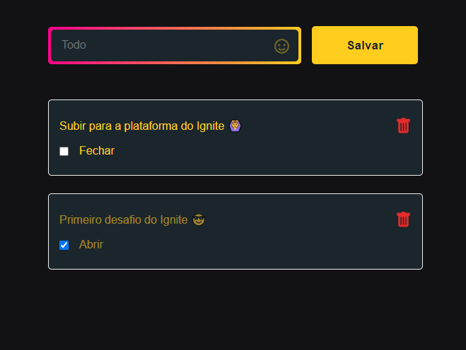

# Todo List

## Preview




## Descrição

Web App React Js para a resolução do primeiro desafio do Ignite da trilha React.
Foi solicitado um app de criação de afazeres (TodoList);

## Instalação e configurações

Faça o clone do repositório com:

```
git clone https://github.com/Raellopes368/IGNITE-DESAFIO1-REACT.git
```

Logo após baixar o repo, navegue até a pasta do projeto:

```
cd IGNITE-DESAFIO1-REACT
```

Então instale as dependências:

```bash
yarn
#ou
npm install

```
Crie um arquivo chamado **.env** na raíz do projeto e adicione as configurações contidas em **.env.example**.

Após isso, você pode rodar o app com:
```
  yarn dev
  #ou 
  npm run dev
```

Você encontrará o App em *http://localhost:3000*


## Pacotes principais:

- [React](https://pt-br.reactjs.org/docs/hello-world.html)
- [Babel](https://babeljs.io/)
- [Webpack](https://webpack.js.org/)
- [Emoji-picker-react](https://www.npmjs.com/package/emoji-picker-react)
- [Typescript](https://www.typescriptlang.org/docs/)


## Features

- [x] Criação de todos.
- [x] Listagem de todos.
- [x] Remoção de um todo.
- [x] Uso de emojis.
- [] Salvar em banco de dados.
- [] Consumo de APIs.